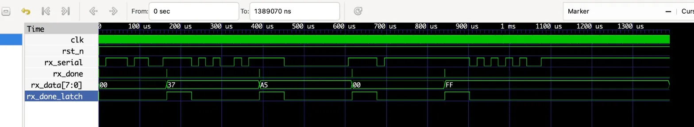
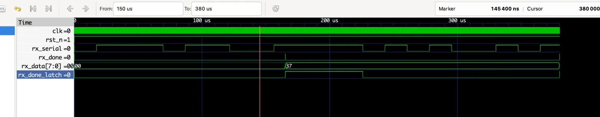

# UART Receiver (RX) in Verilog

This module complements the [uart-verilog](https://github.com/hominhthao/uart-verilog)
transmitter to form a complete **full-duplex UART (8N1)** implementation.

## Overview

The `uart_rx` module receives a serial UART stream and outputs an 8-bit
parallel byte with a `rx_done` strobe signal.

- **FSM-based** design with center-sampling for robust bit detection
- **Double-flop synchronizer** on RX input (prevents metastability)
- **Framing error detection** (invalid stop bit silently discards frame)
- **Parameterizable baud rate** via `CLKS_PER_BIT`

---

## UART Frame Format (8N1)
```
Idle  Start   D0   D1   D2   D3   D4   D5   D6   D7   Stop  Idle
  1     0     lsb  ...  ...  ...  ...  ...  ...  msb    1     1
        ←──────────────── 10 bit periods ────────────────→
```

---

## FSM State Diagram
```
         ┌─────────┐
  reset  │         │  rx_in falls to 0
 ──────▶ │  IDLE   │─────────────────────▶┌────────────┐
         │         │                       │ START_BIT  │ wait to mid-bit
         └─────────┘                       └─────┬──────┘
              ▲                                  │ confirmed 0
              │ false trigger                    ▼
              │ (rx_in=1 at mid)          ┌────────────┐
              └───────────────────────────│  DATA_BITS │ sample 8 bits
                                          └─────┬──────┘
                                                │ 8 bits done
                                                ▼
                                         ┌────────────┐
                                         │  STOP_BIT  │ verify stop=1
                                         └─────┬──────┘
                                               │
                                               ▼
                                         ┌────────────┐
                                         │  CLEANUP   │──▶ IDLE
                                         └────────────┘
```

---

## Parameters

| Parameter      | Default | Description                      |
|----------------|---------|----------------------------------|
| `CLKS_PER_BIT` | 868     | Clock cycles per UART bit period |

**Baud rate formula:**
```
CLKS_PER_BIT = CLK_FREQ / BAUD_RATE
```

| Clock  | Baud Rate | CLKS_PER_BIT |
|--------|-----------|--------------|
| 50 MHz | 115200    | 434          |
| 50 MHz | 57600     | 868          |
| 25 MHz | 115200    | 217          |

---

## Port Description

| Port        | Dir    | Width | Description                           |
|-------------|--------|-------|---------------------------------------|
| `clk`       | input  | 1     | System clock                          |
| `rst_n`     | input  | 1     | Active-low synchronous reset          |
| `rx_serial` | input  | 1     | UART serial input line                |
| `rx_done`   | output | 1     | Pulses HIGH for 1 clk when byte ready |
| `rx_data`   | output | 8     | Received byte (valid when rx_done=1)  |

---

## Project Structure
```
uart-rx-verilog/
├── src/
│   └── uart_rx.v              # RX RTL module
├── tb/
│   ├── uart_rx_tb.v           # Directed testbench (5 test cases)
│   └── uart_loopback_tb.v     # Full loopback test (TX → RX)
├── sim/
│   └── waveform/
│       ├── uart_rx_1.png      # Overview waveform
│       └── uart_rx_2.png      # Zoom — single UART frame
├── Makefile
└── README.md
```

---

## Simulation

### Prerequisites
- [Icarus Verilog](http://iverilog.icarus.com/)
- [GTKWave](http://gtkwave.sourceforge.net/)

### Run with Makefile
```bash
make rx          # RX directed testbench
make loopback    # Full TX→RX loopback test
make wave_rx     # Open RX waveform in GTKWave
make clean       # Remove build artifacts
```

---

## Test Results

### RX Directed Testbench

| Test | Input          | Expected      | Result  |
|------|----------------|---------------|---------|
| TC1  | `0x37`         | `0x37`        | ✅ PASS |
| TC2  | `0xA5`         | `0xA5`        | ✅ PASS |
| TC3  | `0x00`         | `0x00`        | ✅ PASS |
| TC4  | `0xFF`         | `0xFF`        | ✅ PASS |
| TC5  | Framing error  | rx_done = 0   | ✅ PASS |

### Loopback Testbench (TX → RX)

| Byte   | Result  |
|--------|---------|
| `0xA5` | ✅ PASS |
| `0x3C` | ✅ PASS |
| `0x00` | ✅ PASS |
| `0xFF` | ✅ PASS |
| `0x55` | ✅ PASS |

---

## Simulation Waveform

### Overview — full simulation



### Zoom — single UART frame (byte 0x37)



---

## Related

- [uart-verilog](https://github.com/hominhthao/uart-verilog) — UART Transmitter (TX)

---

## Author

**Ho Minh Thao**
Electronics & Telecommunications Engineering — HCMUT
Interested in Digital IC Design, RTL Design, and VLSI Systems
